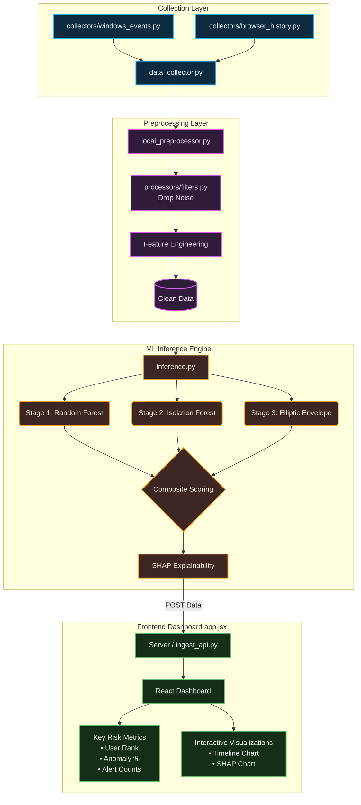

<div align="center">
  
  <br>
  <em>Local telemetry. Hybrid machine learning. Explainable threat detection.</em>
</div>

---

## How it works 

#  Setup & Installation

## Server Environment

1. Download the `dist/server` directory onto your host server.

2. Run the server environment using Docker Compose:

   ```bash
   docker compose up -d
   ```

3. Access the dashboard via your browser at:

   ```
   http://localhost:5000
   ```

## Local Data Collector Client

1. run the installation script ```installer.py``` on the target device:


2. During setup, you will be prompted to configure the server's API endpoint the default value is ```http://localhost:8000``` but you can change the api endpoint depending on your configuration.
